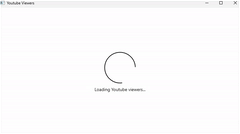
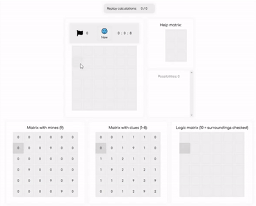

# Olá!

### Sobre mim:

- 🎓 Bacharel em Engenharia Elétrica pela PUC-Campinas;
- 📚 Curso Full-Stack DEVinHouse - SENAI/SC;
- 🎮 Adoro jogos, principalmente de RPG e FPS;
- 💻 Buscando novas soluções através de aplicações Web ou Desktop;
- 🎵 ☕ Preciso de música e café!

  

      
    
  

 

### Experiência Profissional

### Projetos

 

### Contato:

  
  
rafaelyut@hotmail.com

 

---

## Alguns projetos:

 <table>
  <tr>
    <td>
    <strong>Aplicação Desktop - YoutubeViewers (WPF)</strong> 
     (MVVM, State Management, Dependecy Injection, Entity Framework (SQLite), CRUD, Publishing)
       </img> 
    <a target="_blank" href="https://github.com/RafaelYukio/estudosWPF-.net">Repositório</a> - 
    <a target="_blank" href="https://github.com/RafaelYukio/estudosWPF-.net/releases/download/v1.0.0/YoutubeViewers.WPF.1.0.0.zip">Download</a>
    </td>
    <td>
        
    </td>
  </tr>
  <tr>
    <td>
    <strong>Aplicação Web - Jogo de Campo Minado (React com TypeScript)</strong> (Componentização, Styled Components, Hooks, Router, Axios, GitHub Pages)
       </img> 
    <a target="_blank" href="https://github.com/RafaelYukio/estudos-React">Repositório</a> - 
    <a target="_blank" href="https://rafaelyukio.github.io/estudos-React/#/minesweeper">Site</a>
    </td>
    <td>
        
    </td>
  </tr>
    <tr>
    <td>
    <strong>To-do list</strong> 
    (HTML, CSS, JavaScript) (curso DevInHouse):
       </img> 
    <a target="_blank" href="https://github.com/RafaelYukio/DEVinHouse_M1P1">Repositório</a> - 
    <a target="_blank" href="https://rafaelyukio.github.io/DEVinHouse_M1P1/to_do.html">Site</a>
    </td>
    <td>
    </td>
  </tr>
</table>
