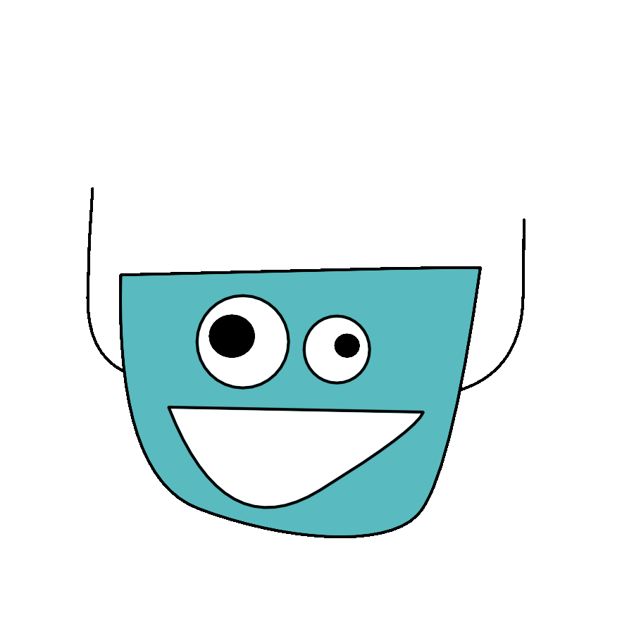

#  Olar!
### Me chamo Rafael, formado em Eng. Elétrica, mas me encontrei na tecnologia!

____

## Projetos:
- To-do list (HTML, CSS, JavaScript):
  - https://rafaelyukio.github.io/DEVinHouse_M1P1/to_do.html
- Jogo de Campo Minado (React com TypeScript) (deply com GitHub Pages)
  - https://rafaelyukio.github.io/estudos-React/
 
____
 

### Estudando para ser um fullstack!
 

  

